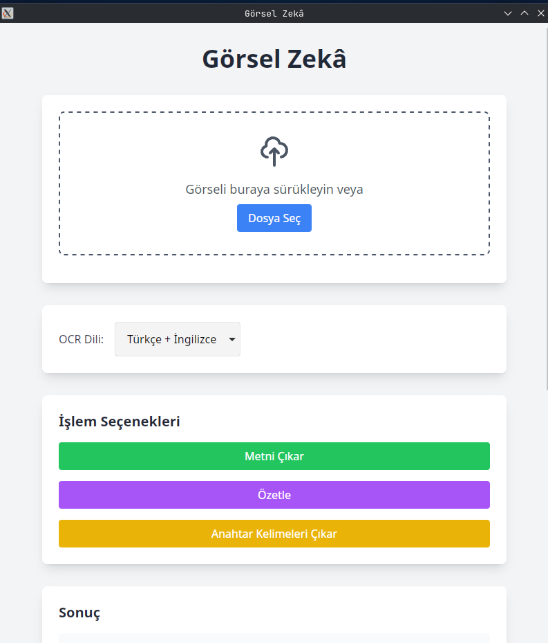

# Visual Intelligence – OCR & Information Extraction Desktop App

A modern, user-friendly desktop application for extracting text from images (screenshots, document photos, handwriting, PDFs, etc.) and performing advanced text processing (summarization, keyword extraction, analysis).

---

## Features

- 📤 Image & PDF upload (drag & drop or file input)
- 📝 OCR text extraction (Tesseract)
- 📋 Text summarization (HuggingFace Transformers for Turkish/English)
- 🔑 Keyword extraction (TF-IDF, Turkish stopwords)
- 🧠 Table, QR, and barcode detection in images
- 💻 Desktop app experience (via pywebview)
- 🕑 Output history (see your last 10 results)
- Responsive, modern UI (TailwindCSS, Vanilla JS)

---

## Project Structure

```
visual-intelligence/
│
├── backend/
│   ├── app.py                # Flask backend (API)
│   └── utils.py              # OCR, summarization, keyword, table, QR/barcode utils
│
├── frontend/
│   └── index.html            # Main UI (HTML + TailwindCSS + JS)
│
├── assets/                   # Images, icons, logos, etc.
│
├── main.py                   # pywebview desktop launcher
├── requirements.txt          # All Python dependencies
└── README.md
```

---

## Installation

### 1. System Dependencies
- **Tesseract OCR** (>= 5.0 recommended)
- **ZBar** (>= 0.23 for QR/barcode detection)

Install on Ubuntu/Debian:
```bash
sudo apt update
sudo apt install tesseract-ocr libzbar0
```

#### Language Packs for OCR
For Turkish and English OCR, install language packs:
```bash
sudo apt install tesseract-ocr-tur tesseract-ocr-eng
```

### 2. Python Dependencies
It is recommended to use a virtual environment.
```bash
pip install -r requirements.txt
```

If you see errors about missing system libraries (e.g. for `pyzbar`, `opencv`, `torch`), install them via your package manager.

---

## Usage

### Desktop Mode
```bash
python3 main.py
```
This will launch the Flask backend and open the app in a desktop window.

### Web Mode (development)
```bash
cd backend
python3 app.py
```
Then open `frontend/index.html` in your browser (CORS must be enabled for API calls).

---

## API Endpoints

| Endpoint         | Method | Description                  | Request Body                        | Response Example           |
|------------------|--------|------------------------------|-------------------------------------|----------------------------|
| `/extract-text`  | POST   | Upload image/PDF, get OCR    | `{ "image": <base64>, "lang": "tur+eng", "filetype": "image" }` | `{ "text": "...", "qr_barcodes": [...], "tables": [...] }` |
| `/summarize`     | POST   | Summarize input text         | `{ "text": "..." }`                | `{ "summary": "..." }`    |
| `/keywords`      | POST   | Extract keywords             | `{ "text": "..." }`                | `{ "keywords": ["...", ...] }` |

---

## Main Technologies
- **Frontend:** HTML, TailwindCSS, Vanilla JS
- **Backend:** Python, Flask, Flask-CORS
- **OCR:** pytesseract, Pillow
- **Summarization:** HuggingFace Transformers (mT5 XLSum for Turkish/English)
- **Keyword Extraction:** scikit-learn (TF-IDF), Turkish stopwords
- **Table/QR/Barcode:** OpenCV, pyzbar
- **PDF Support:** PyMuPDF
- **Desktop:** pywebview

---

## Advanced Features
- **Language selection for OCR** (Turkish/English)
- **PDF text extraction**
- **Table detection in images**
- **QR/barcode reading**
- **Summarization fallback:** If the advanced model fails, a simple summarizer is used.
- **Copy to clipboard** for all results

---

## Performance & Resource Notes
- **OCR:** For best results, use high-quality images and ensure Tesseract language packs are installed.
- **Summarization:** HuggingFace models require a good internet connection for the first run (model download) and at least 4GB RAM (8GB+ recommended for large texts). CPU is sufficient, but GPU will speed up processing if available.
- **Table/QR/Barcode:** Detection is best with clear, high-contrast images.

---

## Example UI (Screenshot)



> _If you don't see the image, add a screenshot named `ui-screenshot.png` to the `assets/` folder._

---

## Example Minimal UI Markup
```html
<div class="container mx-auto p-4">
  <h1 class="text-3xl font-bold mb-4">Visual Intelligence</h1>
  <input type="file" id="imageInput" accept="image/*,application/pdf" />
  <button id="uploadBtn" class="bg-blue-600 text-white px-4 py-2 rounded mt-2">Upload</button>
  <textarea id="ocrResult" class="w-full mt-4 p-2 border rounded" rows="10" placeholder="OCR result will appear here"></textarea>
  <!-- More sections for summarize, keywords, etc. -->
</div>
```

---


---

## Project Status & Contribution

This project is **not fully complete** and is open to further development and improvements. Contributions, feature requests, and feedback are welcome!

- Planned improvements: more advanced summarization, better multi-language support, improved table/QR/barcode extraction, UI/UX enhancements, and more.
- Feel free to open issues or submit pull requests.

--- 
